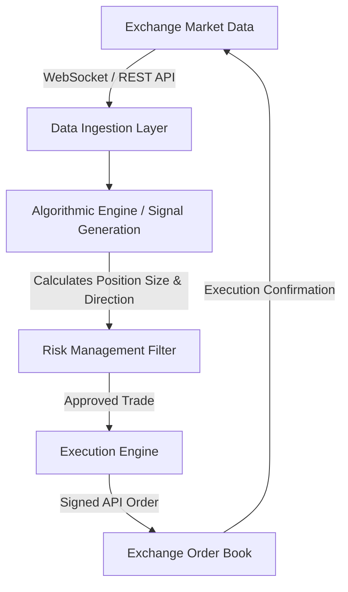

# How Do Crypto Trading Bots Work? The Complete Guide (2026)

**Crypto trading bots** are software programs that connect directly to cryptocurrency exchanges via APIs to automate trading strategies. They work by continuously polling market data (prices, order books, volume), running this data through a pre-defined set of rules or algorithmic models, and automatically executing buy or sell orders when specific triggers are met.

> **Get Heikin Ashi alerts live**: Sanddock detects swing reversals on 50+ coins in real time. [Start free today →](/signup)

## What is a crypto trading bot?

A crypto trading bot is an automated software tool that interacts with cryptocurrency exchanges using API keys to place trades based on predefined rules. It eliminates the need for manual order placement, allowing strategies to run continuously 24/7 without emotional bias.

Unlike human traders who must sleep, eat, and analyze charts manually, a trading bot is a set of instructions written in code (typically Python, Node.js, or C++) that executes trades the instant market conditions match its parameters. These parameters can range from basic mathematical operations, such as "buy when the price falls 5%," to complex multi-factor setups involving moving averages, momentum oscillators, or artificial intelligence algorithms.

Bots do not possess intuition or "gut feelings." They are entirely quantitative, executing trades with strict adherence to their programmed logic. While this removes emotional pitfalls like panic selling or FOMO (fear of missing out), it also means they will execute losing strategies just as faithfully as winning ones if the market changes.

## How do crypto trading bots work under the hood?

Under the hood, a trading bot operates in a continuous loop consisting of three main phases: data ingestion, signal generation (decision making), and order execution. It pulls market data via WebSockets or REST APIs, processes it through algorithmic logic, and sends signed trade instructions back to the exchange.



### 1. The Data Ingestion Layer
Before a bot can make a decision, it needs data. It gathers this data from exchanges in two ways:
*   **REST APIs (Polling):** The bot periodically sends HTTP requests to the exchange (e.g., every 5 seconds) to fetch the latest price, historical candles, or order book depth.
*   **WebSockets (Streaming):** The bot opens a persistent connection to the exchange. The exchange then pushes data in real-time to the bot the millisecond a trade occurs or the order book changes. WebSocket streaming is standard for high-frequency or time-sensitive strategies.

### 2. The Algorithmic Engine (Signal Generation)
Once the bot has the raw data, it processes it. If the bot is programmed to use the Relative Strength Index (RSI), it calculates the current RSI value based on recent price movements. If it is an AI-powered signal engine like Sanddock, it may convert standard candlesticks to Heikin Ashi candles, run a rolling-window swing top/bottom check, and run a scoring module to determine if a reversal is high-probability. The output of this layer is a decision: Buy, Sell, Hold, or Close.

### 3. The Risk Management Filter
Before sending an order, a well-built bot passes the signal through a risk management module. This module checks:
*   **Position Sizing:** How much of the total portfolio should be allocated to this trade (e.g., 2% max)?
*   **Portfolio Exposure:** Are too many correlated trades already open?
*   **Stop-Loss/Take-Profit:** Are the risk boundaries clearly set?

### 4. The Execution Engine
If the trade passes the risk filters, the execution engine translates the decision into a formatted API request. It signs the request using the user's private API secret and transmits it to the exchange. The exchange validates the request, verifies the signature, and posts the order to the ledger. Once filled, the exchange sends a confirmation message back, and the bot updates its internal state database.

## What are the main types of crypto trading bots?

The main types of crypto trading bots include Grid trading bots, Dollar-Cost Averaging (DCA) bots, Arbitrage bots, and Technical Indicator (or algorithmic) bots. Each serves a specific market condition, such as range-bound consolidation, long-term accumulation, or price discrepancies between exchanges.

The table below breaks down these primary classes of trading bots:

| Bot Type | Core Strategy | Best Market Condition | Primary Risk Factor |
| :--- | :--- | :--- | :--- |
| **Grid Trading Bot** | Places a grid of buy/sell limit orders at set intervals | Sideways / Consolidation | Trend breakout (price leaves the grid) |
| **DCA Bot** | Buys fixed dollar amounts at set intervals or dip steps | Bear Market / Accumulation | Prolonged downtrend without recovery |
| **Arbitrage Bot** | Exploits price differences between exchanges or pairs | Any (high volatility helps) | Execution delay (slippage/latency) |
| **Algorithmic Bot** | Trades based on technical indicators (RSI, MACD, Heikin Ashi) | Strong Trends or Reversals | False signals in choppy markets |

### Grid Trading Bots
Grid bots divide a specified price range into a "grid" of horizontal lines. It places buy limit orders below the current price and sell limit orders above it. When the price dips and triggers a buy order, the bot immediately places a corresponding sell order one grid level higher. As the price fluctuates back and forth, the bot accumulates small profits. However, if the price breaks out of the grid range entirely (e.g., a massive dump), the bot will be left holding a bag of depreciating assets.

### Dollar-Cost Averaging (DCA) Bots
DCA bots automate the practice of investing fixed amounts at regular intervals, regardless of price. Advanced crypto DCA bots use "Safety Orders." If you buy a coin and it drops 2%, the bot executes a safety order to buy more, lowering your average entry price. This makes it easier to exit the trade in profit on a minor rebound. The risk is that if the asset continues to fall indefinitely, the bot will buy all the way down, tying up all your capital.

### Arbitrage Bots
Arbitrage bots monitor different exchanges (e.g., Binance vs. Coinbase) or different trading pairs on the same exchange. If Bitcoin is trading at $60,000 on one exchange and $60,050 on another, the bot will instantly buy on the cheaper exchange and sell on the more expensive one, pocketing the difference. These bots rely on microsecond execution speeds and deep liquidity.

### Algorithmic & Indicator Bots
These bots execute trades based on math-based chart indicators. For example, a bot might buy when the 50-period moving average crosses above the 200-period moving average (a "Golden Cross"). More sophisticated systems incorporate custom indicators like Heikin Ashi candles to filter out volatile "wicks" and identify true swing tops and bottoms.

## How do you set up and connect a trading bot?

To set up a trading bot, you must register on a bot platform (or host your own code), generate API keys from your crypto exchange account, configure permission scopes, and paste these keys into the bot. The bot then uses these credentials to read your balance and execute trades.

Connecting a bot safely requires following a strict security checklist:

1.  **Generate API Keys:** Go to your exchange account settings and locate the API Management section. Generate a new API Key and Secret Key. The API key is public; the Secret key is private and will only be displayed once.
2.  **Configure Permissions:** API keys have permission checkboxes. 
    *   *Enable Read/Info:* (Required) Allows the bot to check balances and historical data.
    *   *Enable Trading/Write:* (Required) Allows the bot to open and close positions.
    *   *Enable Withdrawals:* **(NEVER ENABLE)** This permits the transfer of funds out of the account. A secure trading bot never needs withdrawal access.
3.  **Apply IP Whitelisting:** If your bot provider uses fixed server IPs, enter those IPs into the exchange API settings. This ensures that even if your API key is stolen, it can only be used from the bot provider's specific, trusted servers.
4.  **Configure Bot Parameters:** Input the API keys into your bot control panel, select your trading pair (e.g., SOL/USDT), set your risk size, configure your stop-loss, and activate the bot.

## What are the risks of using crypto trading bots?

The primary risks of crypto trading bots include API security breaches, software bugs or connection lag, market anomalies (flash crashes), and strategy obsolescence. Automated systems execute rules blindly; if a strategy is poorly optimized or the market structure shifts, they can rapidly deplete your capital.

*   **Security Risks:** If you store your API keys on a third-party bot platform and that platform is hacked, malicious actors could perform "pump-and-dump" attacks. While they cannot withdraw your funds directly (assuming withdrawals are disabled), they can use your balance to buy illiquid coins at inflated prices to enrich their own accounts.
*   **Operational Risks (System Lag):** Bots rely on continuous internet connections. If the exchange suffers downtime, if your bot server loses internet connection, or if API rate limits are exceeded, your stop-loss order may not get executed, resulting in unmanaged losses.
*   **Market Slippage:** During periods of extreme volatility, prices move so fast that your bot's order may execute at a significantly worse price than intended. This is known as slippage, and it can turn a theoretically profitable strategy into a losing one.
*   **Over-Optimization (Curve Fitting):** When building a bot, it is easy to backtest parameters against historical data until they look perfect. However, markets change. A bot optimized perfectly for the low-volatility conditions of last month may perform terribly in a high-volatility breakout phase this month.

## Frequently asked questions

**Are crypto trading bots profitable?**
Bots are only as profitable as the underlying strategy they are programmed to run. A bot is an execution tool, not a wealth generator. If your trading rules are solid, the bot will execute them efficiently. If your strategy has no edge, the bot will lose your money faster than you could manually.

**Is using trading bots legal in crypto?**
Yes, using trading bots is completely legal. Exchanges actually encourage the use of bots because they provide liquidity to the order books and generate trading volume, which translates into exchange fee revenue. Most major exchanges provide official API documentation and libraries to help developers build bots.

**Can I run a crypto trading bot for free?**
Yes. You can write your own Python scripts using free open-source libraries like CCXT (CryptoCurrency eXchange Trading library), or use built-in grid and DCA bots offered for free directly inside exchange platforms like Binance, OKX, and Bybit.

**Do bots work when the exchange is offline?**
No. If an exchange goes offline for scheduled maintenance or due to a system crash, its API will stop responding. A bot cannot check prices or place orders during this time, leaving any active positions unmonitored.

***

**Disclaimer:** *Trading cryptocurrencies involves substantial risk. Automated trading tools and bots do not guarantee profits and can execute losing trades automatically. Always test strategies in a simulated environment (paper trading) before risking real capital.*

<!-- ============================================ -->
<!-- SCHEMA MARKUP -->
<!-- ============================================ -->
```json
{
  "@context": "https://schema.org",
  "@graph": [
    {
      "@type": "Article",
      "headline": "How Do Crypto Trading Bots Work? The Complete Guide",
      "description": "Learn how crypto trading bots work under the hood. Discover the different types of bots (grid, DCA, arbitrage), how they interface with exchanges via API, and the risks of automated trading.",
      "author": {
        "@type": "Organization",
        "name": "Sanddock Research Team"
      },
      "publisher": {
        "@type": "Organization",
        "name": "Sanddock"
      },
      "dateModified": "2026-06-30"
    },
    {
      "@type": "FAQPage",
      "mainEntity": [
        {
          "@type": "Question",
          "name": "Are crypto trading bots profitable?",
          "acceptedAnswer": {
            "@type": "Answer",
            "text": "Bots are only as profitable as the underlying strategy they are programmed to run. If your trading rules are solid, the bot will execute them efficiently. If your strategy has no edge, the bot will lose your money."
          }
        },
        {
          "@type": "Question",
          "name": "Is using trading bots legal in crypto?",
          "acceptedAnswer": {
            "@type": "Answer",
            "text": "Yes, using trading bots is completely legal. Exchanges encourage the use of bots because they provide liquidity to the order books and generate trading volume."
          }
        },
        {
          "@type": "Question",
          "name": "Can I run a crypto trading bot for free?",
          "acceptedAnswer": {
            "@type": "Answer",
            "text": "Yes. You can write your own Python scripts using open-source libraries like CCXT, or use built-in grid and DCA bots offered for free directly inside exchange platforms."
          }
        },
        {
          "@type": "Question",
          "name": "Do bots work when the exchange is offline?",
          "acceptedAnswer": {
            "@type": "Answer",
            "text": "No. If an exchange goes offline, its API will stop responding. A bot cannot check prices or place orders during this time, leaving active positions unmonitored."
          }
        }
      ]
    }
  ]
}
```
