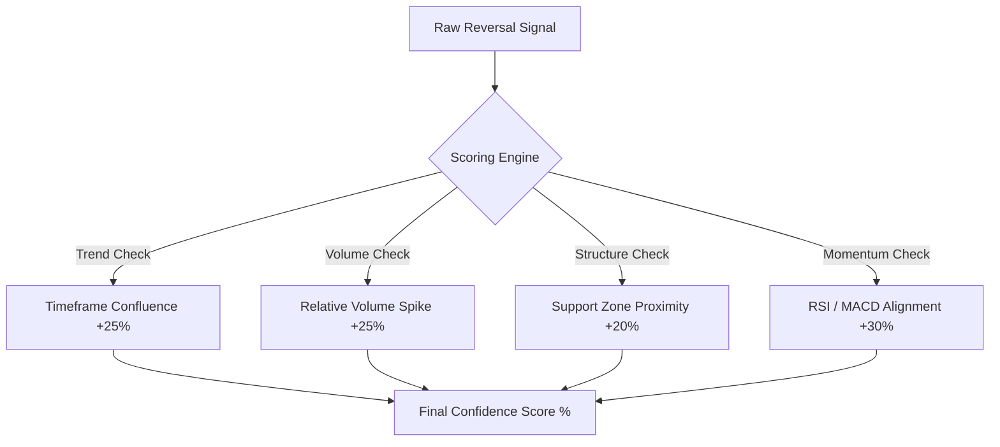

# What Is a Confidence Score in Trading Signals?

A **confidence score** in trading signals is a numerical metric (often expressed as a percentage or scale from 1 to 10) that represents the statistical probability of a trade setup succeeding. Calculated by signal algorithms, it weights multiple supporting factors-such as volume, trend alignment, and volatility-to score the strength of the trade.

> **Get Heikin Ashi alerts live**: Sanddock detects swing reversals on 50+ coins in real time. [Start free today →](/signup)

## What does a confidence score represent in trading?

In trading, a confidence score represents the degree to which a specific market setup aligns with historical winning patterns. It is not a guarantee of success, but a quantitative measure of alignment across multiple independent technical criteria.

Many manual traders look at charts and feel conflicted: the Relative Strength Index (RSI) might show that an asset is oversold (bullish), but the price is trading below its 200-day moving average (bearish), and the trading volume is drying up (neutral). 

An algorithmic confidence score resolves this confusion by processing all these technical inputs simultaneously. The scoring model weighs each indicator based on historical performance data and generates a single, objective score. This score helps traders immediately distinguish between a mediocre, high-risk trade setup and a high-probability trade where all major technical alignment points are met.

## How do algorithmic engines calculate confidence scores?

Algorithmic engines calculate confidence scores using scoring matrices that assign weights to different market parameters. Common inputs include volume validation, higher-timeframe trend alignment, volatility indexes (ATR), and support/resistance proximity.



A typical confidence scoring algorithm evaluates four core categories:

*   **Trend Confluence (Weight: ~25%):** The engine checks if the signal aligns with the macro trend. If a "Buy" signal is triggered on a 15-minute chart, the engine looks at the 4-hour and Daily charts. If the higher-timeframe trend is also bullish, the confidence score increases.
*   **Volume Inflow (Weight: ~25%):** Reversals require capital injection. The engine compares the volume on the breakout candle to the average volume of the last 20 candles. A breakout on 2x average volume adds significant points to the score; a breakout on low volume reduces it.
*   **Market Structure (Weight: ~20%):** The engine calculates how close the entry price is to established historical support or resistance lines. If a long signal fires right at a major weekly support level, the score goes up because the stop-loss can be placed very close, reducing risk.
*   **Momentum & Volatility (Weight: ~30%):** The engine analyzes indicators like the Average True Range (ATR) to measure volatility, and oscillators like the RSI or MACD to confirm momentum. High volatility with clean momentum alignment yields a higher score.

## How should traders use confidence scores to manage risk?

Traders should use confidence scores to dynamically adjust their position sizes, allocating more capital to high-confidence setups and less capital (or passing entirely) to low-confidence setups. This optimizes portfolio efficiency and protects against marginal trades.

Instead of treating every trade alert identically, a professional approach involves scaling your exposure based on the strength of the signal. This is called **Dynamic Position Sizing**. 

The table below outlines a model for using confidence scores to guide your trading decisions:

| Confidence Score | Setup Quality | Position Sizing (Risk) | Execution Strategy |
| :--- | :--- | :--- | :--- |
| **80% - 100%** | **High** | Risk 2.0% of capital | Standard entry, tight stop-loss below local structure |
| **60% - 79%** | **Medium** | Risk 1.0% of capital | Enter with limit orders, monitor closely |
| **40% - 59%** | **Low** | Risk 0.25% or Paper Trade | High risk; best used for testing or skipped entirely |
| **Below 40%** | **Invalid** | Do Not Trade | Ignore; statistical probability is unfavorable |

By risking only a quarter of your usual size on medium-to-low confidence signals, you protect your portfolio during choppy market conditions. When a high-confidence setup appears, you allocate your full risk profile, maximizing profit potential when the statistical edge is in your favor.

## What are the limitations of confidence scores?

The limitations of confidence scores include their inability to predict black swan events, their dependency on historical assumptions, and the risk of user overconfidence. A 95% confidence score trade can still hit its stop-loss if market liquidity suddenly shifts.

*   **No Protection Against Black Swans:** No algorithm can anticipate a sudden exchange hack, a regulatory ban, or a macro-economic panic. If negative news hits the market, even a 99% confidence long setup will break support and fail.
*   **Historical Bias:** Confidence scores are based on what worked in the past. If market dynamics change (e.g., if crypto transitions from a high-volatility speculative asset class into a low-volatility institutional asset class), old scoring metrics may become obsolete.
*   **The Overconfidence Trap:** Beginners often mistake a "high confidence score" for a "sure thing." They might see an 85% score and decide to use 20x leverage or risk 20% of their account. This is dangerous; an 85% confidence score still means there is a statistical 15% chance of failure.

## How does Sanddock calculate confidence scores?

Sanddock calculates confidence scores by running every Heikin Ashi swing detection signal through a multi-factor verification engine. It evaluates higher-timeframe trend alignment, trading volume relative to its 20-period average, ATR volatility, and historical win rates of similar setups.

Sanddock does not hide its calculations in a "black box." When a Buy or Sell signal is issued, the platform shows you the exact factors that contributed to the final score:

1.  **HA Reversal Strength:** How cleanly did the Heikin Ashi candle trend change? (e.g., transition from strong shaved-head red candles to a clean, flat-bottomed green candle).
2.  **Relative Volume Spike:** Was the reversal backed by institutional buying or selling volume?
3.  **Trend Multi-Timeframe Alignment:** Does the trade align with the 1-hour, 4-hour, and daily trend directions?
4.  **Volatility State:** Is the asset expanding out of a squeeze, or is it trading in a exhausted, low-liquidity range?

Traders receive a transparent percentage score along with a written summary explaining the technical logic behind the value, allowing them to make informed decisions.

## Frequently asked questions

**Does a high confidence score mean a trade is guaranteed to win?**
No. In trading, there are no guarantees. A confidence score is a probability metric, not a predictive certainty. A trade with a 90% confidence score simply means that in historical backtests under similar conditions, 9 out of 10 setups resolved in profit. The current trade could still be the 1 out of 10 that fails.

**What is a good confidence score to trade?**
Most algorithmic traders look for signals with a confidence score of 70% or higher. Signals below 60% are generally considered low-probability setups that are highly susceptible to market noise and false breakouts.

**Can a confidence score change after a signal is issued?**
No. Once a signal is locked and sent to the trader, the confidence score represents the market state at the exact moment of execution. While market conditions will evolve after entry, the initial score serves as the historical risk baseline for that trade.

**Why does a signal have a low confidence score?**
A signal may have a low score if the technical indicators are conflicting. For example, a coin might show a bullish price breakout, but the move is occurring on very low trading volume, or the macro trend on the daily chart is heavily bearish.

***

**Disclaimer:** *Trading financial assets, particularly cryptocurrencies, carries a high risk of capital loss. Confidence scores are statistical estimates generated by algorithms based on technical parameters and past data. They do not constitute financial advice. Always use a stop-loss and trade responsibly.*

<!-- ============================================ -->
<!-- SCHEMA MARKUP -->
<!-- ============================================ -->
```json
{
  "@context": "https://schema.org",
  "@graph": [
    {
      "@type": "Article",
      "headline": "What Is a Confidence Score in Trading Signals?",
      "description": "What does a confidence score mean in trading? Learn how quantitative models calculate trade probabilities, what inputs they use, and how to use scores to adjust your position sizing.",
      "author": {
        "@type": "Organization",
        "name": "Sanddock Research Team"
      },
      "publisher": {
        "@type": "Organization",
        "name": "Sanddock"
      },
      "dateModified": "2026-06-30"
    },
    {
      "@type": "FAQPage",
      "mainEntity": [
        {
          "@type": "Question",
          "name": "Does a high confidence score mean a trade is guaranteed to win?",
          "acceptedAnswer": {
            "@type": "Answer",
            "text": "No. A confidence score represents historical probability, not a future guarantee. Even a 90% confidence score trade has a statistical chance of failing due to unpredictable market shifts."
          }
        },
        {
          "@type": "Question",
          "name": "What is a good confidence score to trade?",
          "acceptedAnswer": {
            "@type": "Answer",
            "text": "Traders typically look for confidence scores of 70% or higher for executing active trades. Setups scoring lower are often filtered out or traded with reduced position sizes."
          }
        },
        {
          "@type": "Question",
          "name": "Can a confidence score change after a signal is issued?",
          "acceptedAnswer": {
            "@type": "Answer",
            "text": "No. The score is calculated and locked at the moment the signal triggers, reflecting the exact market parameters present at the time the trade setup formed."
          }
        },
        {
          "@type": "Question",
          "name": "Why does a signal have a low confidence score?",
          "acceptedAnswer": {
            "@type": "Answer",
            "text": "A low score occurs when indicators conflict-such as a bullish reversal occurring on low volume, or counter to the prevailing higher-timeframe trend."
          }
        }
      ]
    }
  ]
}
```
